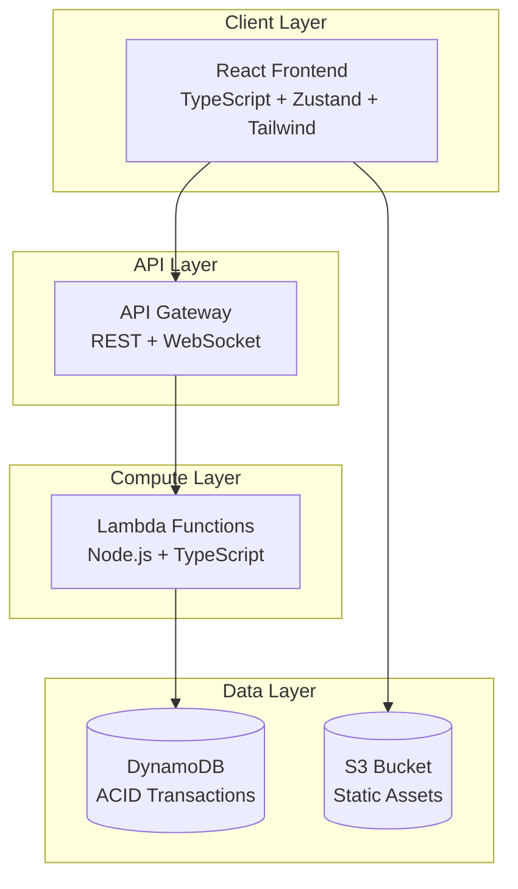

# Number Acidizer

A production-ready, ACID-compliant distributed counter application built with AWS serverless technologies.

## Features

- **ACID Compliance**: Guaranteed consistency with DynamoDB transactions and optimistic locking
- **Real-time Updates**: WebSocket support for instant synchronization across clients
- **Scalable Architecture**: Serverless design that scales automatically
- **Modern UI**: Animated counter using React, TypeScript, and Framer Motion
- **Production Ready**: Full CI/CD pipeline with automated testing and deployment

## Architecture



## Tech Stack

**Frontend:** React 18, TypeScript, Zustand, Framer Motion, Tailwind CSS, Vite
**Backend:** Node.js 18+, AWS Lambda, Pino logging, AWS SDK v3
**Infrastructure:** DynamoDB, API Gateway, CloudFront, S3, ECR, Terraform
**DevOps:** GitHub Actions, Docker, Jest, ESLint

## Quick Start

### Live Demo

| Resource      | URL                                                                            |
| ------------- | ------------------------------------------------------------------------------ |
| **Frontend**  | [https://d1nrvqnzqabwh4.cloudfront.net](https://d1nrvqnzqabwh4.cloudfront.net) |
| **REST API**  | `https://wo9rryet3h.execute-api.eu-central-1.amazonaws.com`                    |
| **WebSocket** | `wss://b5nb3a6s90.execute-api.eu-central-1.amazonaws.com/prod`                 |

### Local Development

```bash
# 1. Clone and install
git clone <repository-url>
cd number-acidizer
npm run install:all

# 2. Start with Docker
docker compose up --build
```

**Access Points:**

- Frontend: http://localhost:3000
- Backend: http://localhost:3001
- DynamoDB Admin: http://localhost:8001

## Production Deployment

Fully automated via GitHub Actions with Terraform infrastructure provisioning.

### Infrastructure Screenshots

For screenshots of the provisioned AWS infrastructure, see [BehindTheScene.md](./docs/BehindTheScene.md).

## Development Timeline

**Total: 5 hours over 4 days**

| Component                  | Time  | Notes                                                  |
| -------------------------- | ----- | ------------------------------------------------------ |
| **Frontend**               | 2 hrs | React setup, WebSocket integration, Tailwind styling   |
| **Backend**                | 1 hr  | Lambda functions, DynamoDB service, WebSocket handlers |
| **Infrastructure & CI/CD** | 2 hrs | Terraform resources, GitHub Actions, OIDC setup        |

## Security & IAM

Comprehensive IAM security model with least privilege access:

- **Developer Access**: Admin user for development operations
- **GitHub Actions**: OIDC-based keyless authentication with scoped permissions
- **Lambda Execution**: Minimal DynamoDB, API Gateway, and logging permissions
- **Resource-Level Security**: Encryption at rest/transit, access logging, monitoring

## Design Decisions

### Why Serverless?

- **Scalability**: Automatic scaling from 0 to thousands of requests
- **Cost Efficiency**: Pay-per-use model (great for free tier)
- **Maintenance**: No server management overhead

### Why DynamoDB with Transactions?

- **ACID Compliance**: Strong consistency with transactions
- **Performance**: Single-digit millisecond latency
- **Scalability**: Handles massive concurrent loads

### Why Optimistic Locking?

- **Performance**: Avoids blocking operations
- **Scalability**: Better throughput under high concurrency
- **ACID Compliance**: Prevents race conditions

## Testing Strategy

Testing infrastructure in place with Jest. In production, I maintain 80%+ coverage.

```bash
# Run all tests
npm test

# Run with coverage
npm run test:coverage

# Run specific test types
# 1. run `docker compose up --build` first then you can run
npm run test:unit
npm run test:integration
npm run test:e2e

# Run ACID compliance tests
cd backend/src/tests
npx ts-node acid-test.ts
```

## Documentation

- **API Documentation**: [API_DOCUMENTATION.md](./docs/API_DOCUMENTATION.md)
- **Architecture Details**: [ARCHITECTURE.md](./docs/ARCHITECTURE.md)
- **CI/CD Pipeline**: [CICD_PIPELINE.md](./docs/CICD_PIPELINE.md)
- **Environment Variables**: [ENVIRONMENT_VARIABLES.md](./docs/ENVIRONMENT_VARIABLES.md)
- **IAM Security**: [IAM_SECURITY.md](./docs/IAM_SECURITY.md)

## Performance & Monitoring

- **Counter Accuracy**: 100% under concurrent load
- **Monitoring**: CloudWatch logs with structured pino logging
- More monitoring and preformance metrics could have been added if I had more time!

## License

MIT License - see [LICENSE](LICENSE) file for details.

---

_Built with ❤️ for demonstrating modern serverless architecture patterns_
