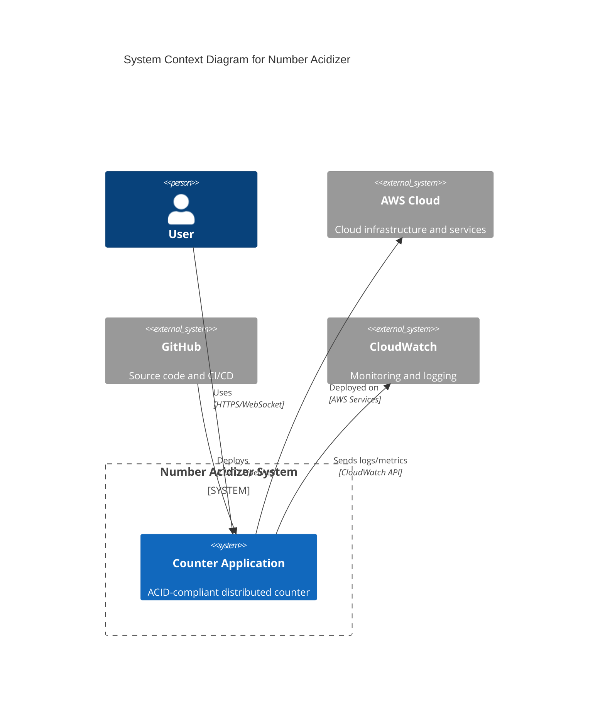
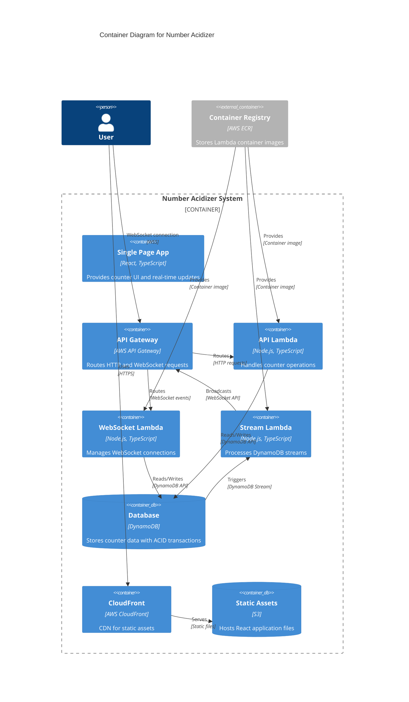
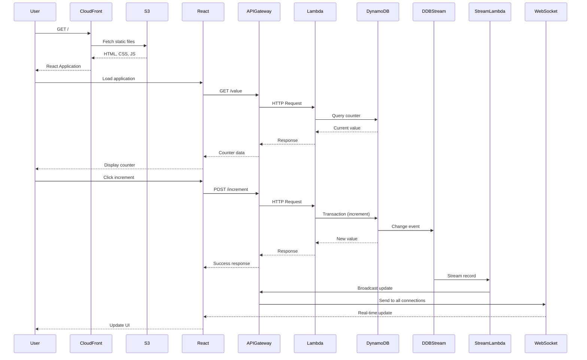
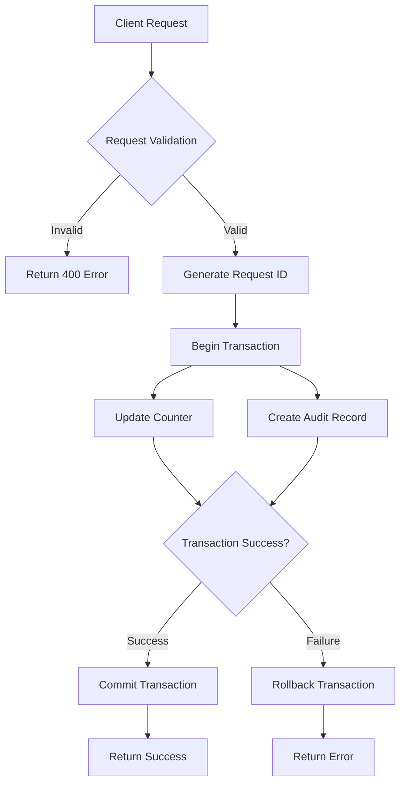

# System Architecture Documentation

Comprehensive documentation of the Number Acidizer system architecture, design patterns, and implementation details.

## Immportant to note here in this file

While I consider myself good at mermaid, most of these drawings are done with the help of Claude + ChatGPT for faster implementation.

## High-Level Architecture

## Container Architecture

## Data Flow Architecture

## ACID Compliance Implementation

