# System Architecture Documentation

Comprehensive documentation of the Number Acidizer system architecture, design patterns, and implementation details.

## High-Level Architecture

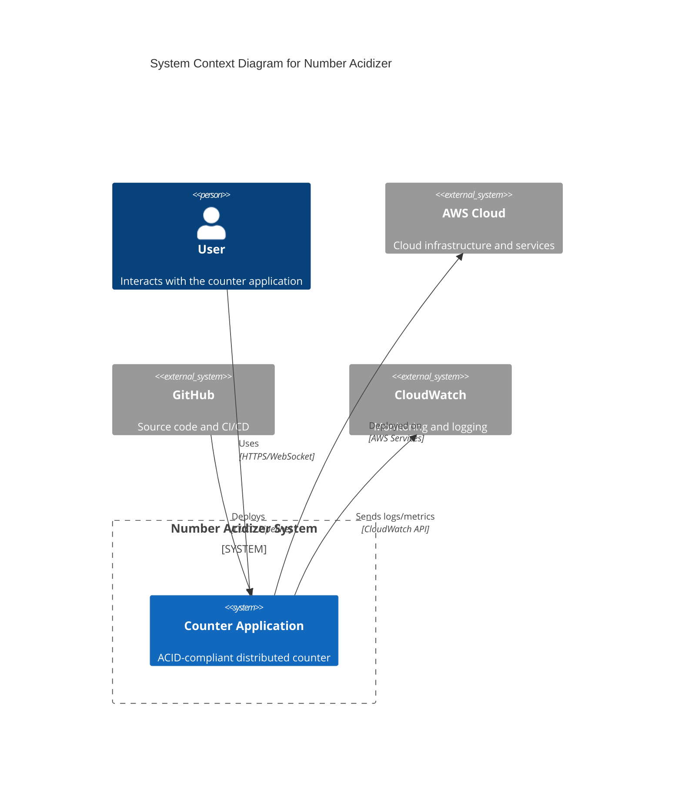

## Container Architecture

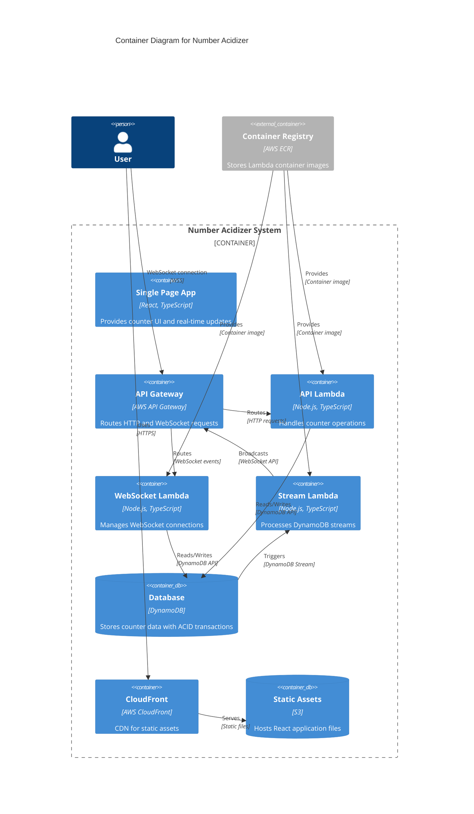

## Component Architecture

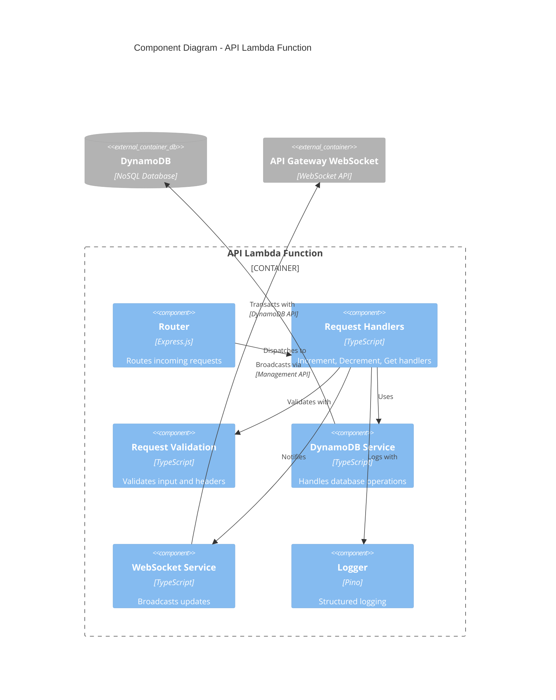

## Data Flow Architecture

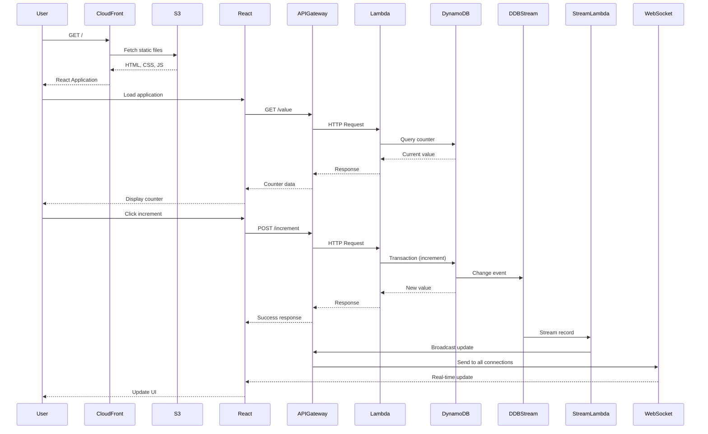

## ACID Compliance Implementation

### Atomicity

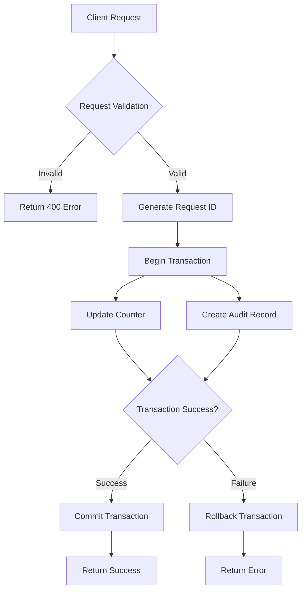

**Implementation Details:**
- DynamoDB TransactWrite ensures all-or-nothing operations
- Counter update and audit log creation happen atomically
- Request ID prevents duplicate operations (idempotency)

### Consistency

```typescript
// Version-based optimistic locking
const updateExpression = 'SET #val = :newVal, #ver = :newVer, #updated = :timestamp';
const conditionExpression = '#ver = :currentVer';

const transactItems = [{
  Update: {
    TableName: this.tableName,
    Key: { id: 'global-counter' },
    UpdateExpression: updateExpression,
    ConditionExpression: conditionExpression,
    ExpressionAttributeNames: {
      '#val': 'value',
      '#ver': 'version',
      '#updated': 'lastUpdated'
    },
    ExpressionAttributeValues: {
      ':newVal': newValue,
      ':newVer': currentVersion + 1,
      ':currentVer': currentVersion,
      ':timestamp': new Date().toISOString()
    }
  }
}];
```

### Isolation

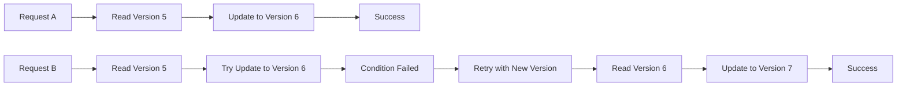

**Key Features:**
- Optimistic locking with version numbers
- Conditional updates prevent race conditions
- Exponential backoff for retry logic
- Maximum retry limit prevents infinite loops

### Durability

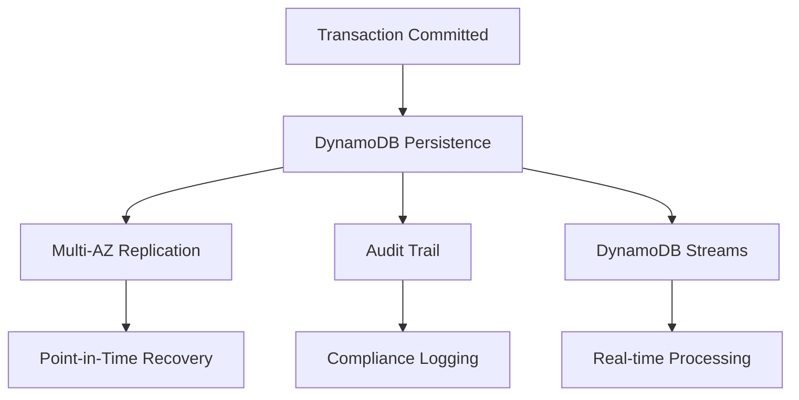

## Scalability Patterns

### Horizontal Scaling

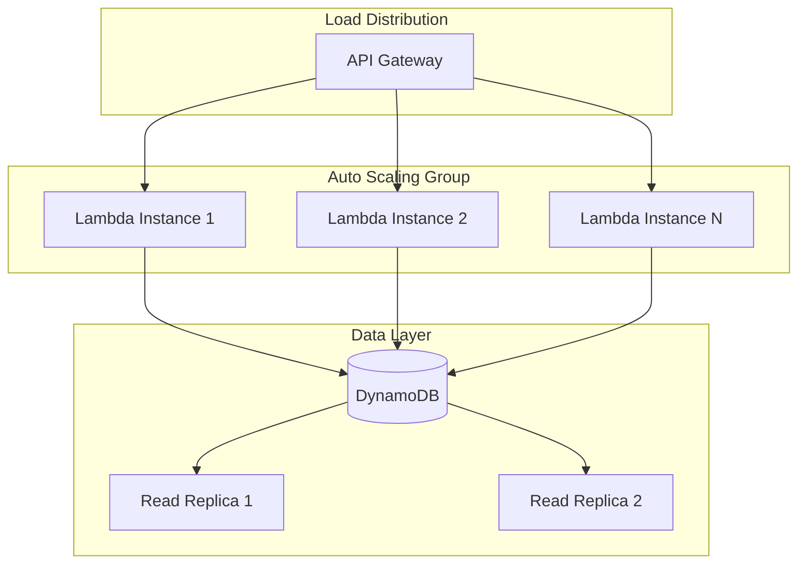

### Performance Optimizations

1. **Connection Pooling**
   ```typescript
   // Reuse DynamoDB connections across invocations
   const client = new DynamoDBClient(config);
   const docClient = DynamoDBDocumentClient.from(client);
   ```

2. **Lambda Provisioned Concurrency**
   ```hcl
   resource "aws_lambda_provisioned_concurrency_config" "api" {
     function_name                     = aws_lambda_function.api.function_name
     provisioned_concurrent_executions = 10
     qualifier                        = aws_lambda_function.api.version
   }
   ```

3. **CloudFront Caching**
   ```hcl
   default_cache_behavior {
     cached_methods         = ["GET", "HEAD"]
     cache_policy_id        = data.aws_cloudfront_cache_policy.caching_optimized.id
     compress               = true
     viewer_protocol_policy = "redirect-to-https"
   }
   ```

## Security Architecture

### Defense in Depth

```mermaid
flowchart TB
    subgraph "Edge Layer"
        WAF[AWS WAF]
        CF[CloudFront]
    end
    
    subgraph "API Layer"
        APIGW[API Gateway]
        THROTTLE[Rate Limiting]
        CORS[CORS Policy]
    end
    
    subgraph "Compute Layer"
        IAM[IAM Roles]
        LAMBDA[Lambda Functions]
        VPC[VPC (Optional)]
    end
    
    subgraph "Data Layer"
        ENCRYPT[Encryption at Rest]
        DDB[(DynamoDB)]
        BACKUP[Point-in-Time Recovery]
    end
    
    WAF --> CF
    CF --> APIGW
    APIGW --> THROTTLE
    THROTTLE --> CORS
    CORS --> IAM
    IAM --> LAMBDA
    LAMBDA --> ENCRYPT
    ENCRYPT --> DDB
    DDB --> BACKUP
```

### IAM Security Model

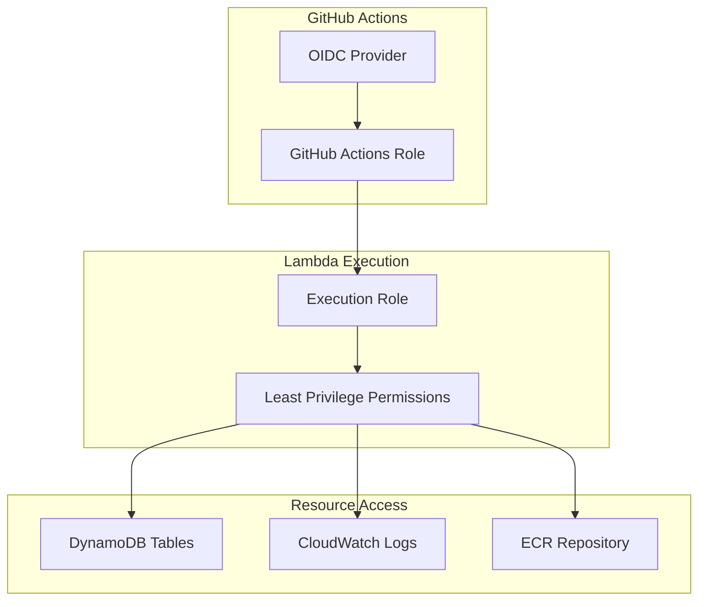

## Monitoring and Observability

### Observability Stack

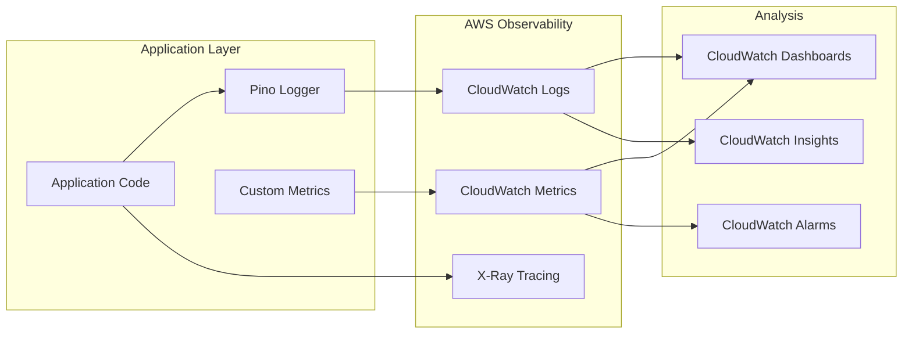

### Structured Logging

```typescript
// Request-scoped logger with correlation ID
const logger = createRequestLogger(
  event.requestContext?.requestId || 'unknown',
  'increment-handler'
);

logger.info({
  operation: 'increment',
  currentValue: counter.value,
  newValue: newValue,
  clientId: clientId,
  duration: Date.now() - startTime
}, 'Counter increment completed');
```

### Custom Metrics

```typescript
// Business metrics
await cloudWatch.putMetricData({
  Namespace: 'NumberAcidizer',
  MetricData: [{
    MetricName: 'CounterOperations',
    Value: 1,
    Unit: 'Count',
    Dimensions: [{
      Name: 'Operation',
      Value: 'increment'
    }]
  }]
}).promise();
```

## Deployment Architecture

### Blue-Green Deployment

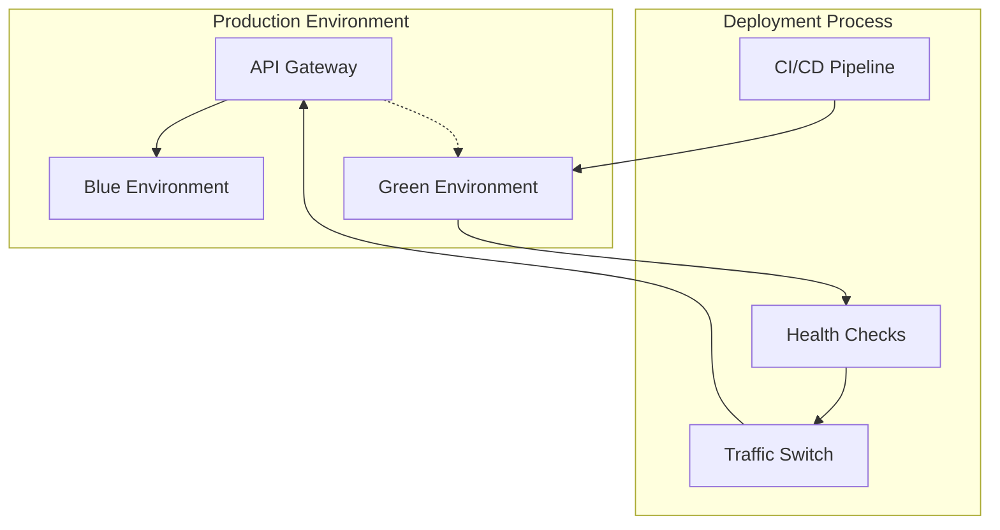

### Infrastructure as Code

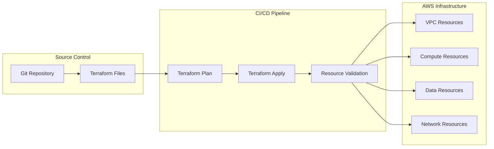

## Error Handling Architecture

### Circuit Breaker Pattern

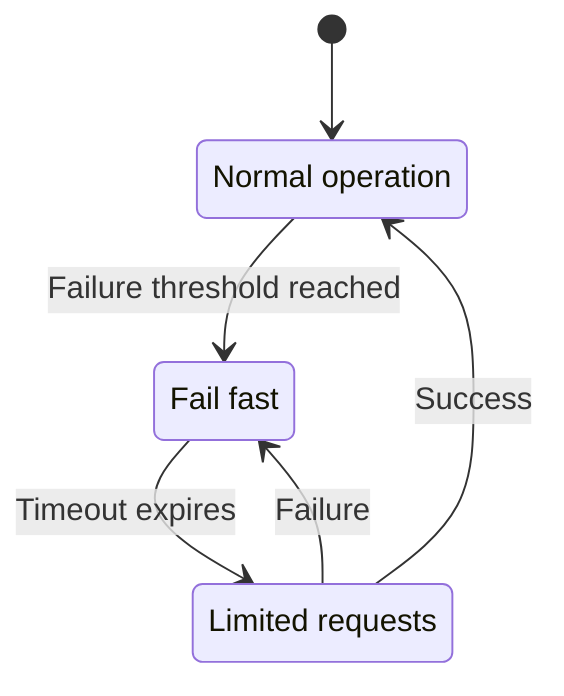

### Retry Strategy

```typescript
async function retryWithExponentialBackoff<T>(
  operation: () => Promise<T>,
  maxRetries: number = 5
): Promise<T> {
  for (let attempt = 0; attempt < maxRetries; attempt++) {
    try {
      return await operation();
    } catch (error) {
      if (attempt === maxRetries - 1) throw error;
      
      const delay = Math.pow(2, attempt) * 100;
      await sleep(delay);
    }
  }
  throw new Error('Max retries exceeded');
}
```

## Performance Characteristics

### Latency Targets

| Operation | Target (p95) | Target (p99) |
|-----------|--------------|--------------|
| GET /value | < 50ms | < 100ms |
| POST /increment | < 100ms | < 200ms |
| POST /decrement | < 100ms | < 200ms |
| WebSocket update | < 50ms | < 100ms |

### Throughput Capacity

| Component | Sustained RPS | Burst RPS |
|-----------|---------------|-----------|
| API Gateway | 10,000 | 20,000 |
| Lambda Functions | 1,000 | 5,000 |
| DynamoDB | 40,000 | 80,000 |
| WebSocket | 1,000 connections | 2,000 connections |

### Resource Utilization

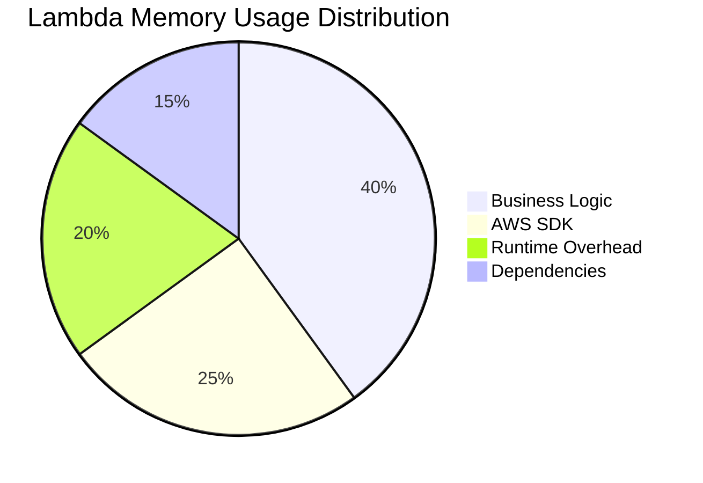

## Technology Stack Rationale

### Frontend Technology Choices

| Technology | Rationale |
|------------|-----------|
| **React** | Component-based architecture, large ecosystem, TypeScript support |
| **TypeScript** | Type safety, better developer experience, compile-time error detection |
| **Zustand** | Lightweight state management, less boilerplate than Redux |
| **Tailwind CSS** | Utility-first CSS, consistent design system, smaller bundle size |
| **Framer Motion** | Smooth animations, declarative API, performance optimized |
| **Vite** | Fast development server, optimized builds, modern tooling |

### Backend Technology Choices

| Technology | Rationale |
|------------|-----------|
| **Node.js** | JavaScript ecosystem, async I/O, Lambda compatibility |
| **TypeScript** | Type safety, better maintainability, shared types with frontend |
| **AWS Lambda** | Serverless scalability, pay-per-use, no server management |
| **DynamoDB** | NoSQL flexibility, built-in transactions, managed service |
| **Pino** | High-performance logging, structured logs, CloudWatch integration |

### Infrastructure Choices

| Technology | Rationale |
|------------|-----------|
| **Terraform** | Infrastructure as Code, state management, multi-cloud support |
| **AWS API Gateway** | Managed API service, WebSocket support, built-in features |
| **CloudFront** | Global CDN, SSL termination, edge caching |
| **ECR** | Managed container registry, integrated with Lambda |
| **GitHub Actions** | Integrated CI/CD, OIDC support, free for public repos |

## Future Architecture Considerations

### Planned Enhancements

1. **Multi-Region Deployment**
   - Global DynamoDB tables
   - Regional Lambda deployments
   - Cross-region failover

2. **Advanced Caching**
   - Redis/ElastiCache for session data
   - Application-level caching
   - Edge computing with Lambda@Edge

3. **Enhanced Security**
   - API authentication with Cognito
   - Request signing
   - VPC deployment for sensitive workloads

4. **Improved Observability**
   - Distributed tracing with X-Ray
   - Custom CloudWatch dashboards
   - Real-time alerting system

### Scalability Roadmap

1. **Phase 1**: Current architecture (1K RPS)
2. **Phase 2**: Regional deployment (10K RPS)
3. **Phase 3**: Global deployment (100K RPS)
4. **Phase 4**: Edge computing (1M RPS)

This architecture document serves as the foundation for understanding, maintaining, and evolving the Number Acidizer system.