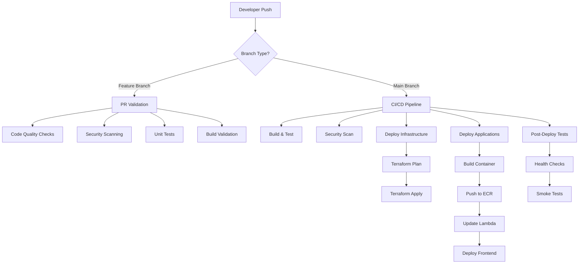

# CI/CD Pipeline Documentation

This document describes the comprehensive CI/CD pipeline implemented using GitHub Actions for the Number Acidizer project.

## Overview

The CI/CD pipeline follows modern DevOps practices with multiple workflows for different scenarios:



## Workflow Files

### 1. Main CI/CD Pipeline (`.github/workflows/ci-cd.yml`)

**Trigger**: Push to `main` branch  
**Purpose**: Complete deployment pipeline

#### Pipeline Stages

##### Stage 1: Build and Test
```yaml
jobs:
  build-and-test:
    runs-on: ubuntu-latest
    steps:
      - name: Checkout code
      - name: Setup Node.js 18
      - name: Install dependencies (root)
      - name: Install dependencies (backend)
      - name: Install dependencies (frontend)
      - name: Lint backend
      - name: Lint frontend
      - name: Build backend
      - name: Build frontend
```

##### Stage 2: Deploy Infrastructure
```yaml
  deploy-infrastructure:
    needs: build-and-test
    runs-on: ubuntu-latest
    permissions:
      id-token: write
      contents: read
    steps:
      - name: Configure AWS credentials
        uses: aws-actions/configure-aws-credentials@v4
        with:
          role-to-assume: ${{ secrets.AWS_ROLE_TO_ASSUME }}
          aws-region: ${{ secrets.AWS_REGION }}
      
      - name: Setup Terraform
      - name: Terraform Init
      - name: Terraform Plan
      - name: Terraform Apply
      - name: Get Terraform Outputs
```

##### Stage 3: Deploy Applications
```yaml
  deploy-applications:
    needs: [build-and-test, deploy-infrastructure]
    runs-on: ubuntu-latest
    steps:
      - name: Build and push Docker image
      - name: Update Lambda functions
      - name: Deploy frontend to S3
      - name: Invalidate CloudFront cache
```

### 2. PR Validation (`.github/workflows/pr-validation.yml`)

**Trigger**: Pull Request opened/updated  
**Purpose**: Quality gates before merge

```yaml
name: PR Validation
on:
  pull_request:
    branches: [main]

jobs:
  validate:
    runs-on: ubuntu-latest
    steps:
      - name: Code quality checks
      - name: Security scanning
      - name: Unit tests
      - name: Build validation
      - name: Integration tests (if applicable)
```

### 3. Pre-merge Checks (`.github/workflows/pre-merge.yml`)

**Trigger**: PR approved and ready to merge  
**Purpose**: Final validation before merge

```yaml
name: Pre-merge Checks
on:
  pull_request:
    types: [labeled]
    # Triggered when 'ready-to-merge' label is added

jobs:
  final-checks:
    runs-on: ubuntu-latest
    steps:
      - name: Run comprehensive test suite
      - name: Performance benchmarks
      - name: Security audit
      - name: Dependency check
```

### 4. Performance Testing (`.github/workflows/performance.yml`)

**Trigger**: Scheduled (nightly) or manual  
**Purpose**: Performance regression testing

```yaml
name: Performance Tests
on:
  schedule:
    - cron: '0 2 * * *'  # Daily at 2 AM
  workflow_dispatch:

jobs:
  performance:
    runs-on: ubuntu-latest
    steps:
      - name: Load testing
      - name: Memory profiling
      - name: Response time analysis
      - name: Generate performance report
```

## GitHub OIDC Integration

### AWS IAM Role Configuration

The pipeline uses OpenID Connect (OIDC) for secure, keyless authentication:

```hcl
# infrastructure/github-oidc.tf
resource "aws_iam_openid_connect_provider" "github" {
  url = "https://token.actions.githubusercontent.com"
  
  client_id_list = [
    "sts.amazonaws.com",
  ]
  
  thumbprint_list = [
    "6938fd4d98bab03faadb97b34396831e3780aea1"
  ]
}

resource "aws_iam_role" "github_actions" {
  name = "github-actions-role"
  
  assume_role_policy = jsonencode({
    Version = "2012-10-17"
    Statement = [
      {
        Action = "sts:AssumeRoleWithWebIdentity"
        Effect = "Allow"
        Principal = {
          Federated = aws_iam_openid_connect_provider.github.arn
        }
        Condition = {
          StringEquals = {
            "token.actions.githubusercontent.com:aud" = "sts.amazonaws.com"
            "token.actions.githubusercontent.com:sub" = "repo:your-username/number-acidizer:ref:refs/heads/main"
          }
        }
      }
    ]
  })
}
```

## Security Features

### 1. Secrets Management
- No AWS credentials stored in repository
- Use GitHub Secrets for sensitive configuration
- Rotate secrets regularly through automation

### 2. Permission Model
```yaml
permissions:
  id-token: write      # Required for OIDC
  contents: read       # Read repository contents
  pull-requests: write # Comment on PRs
  checks: write        # Update check status
```

### 3. Environment Protection
- Production deployments require approval
- Restricted to specific branches
- Environment-specific secrets

## Terraform State Management

### Remote State Configuration
```hcl
terraform {
  backend "s3" {
    bucket = "number-acidizer-terraform-state-825288425159"
    key    = "terraform.tfstate"
    region = "eu-central-1"
    
    # State locking
    dynamodb_table = "terraform-locks"
    encrypt        = true
  }
}
```

### State File Security
- S3 bucket with versioning enabled
- Server-side encryption (AES-256)
- DynamoDB table for state locking
- Cross-region replication for disaster recovery

## Deployment Strategies

### 1. Blue-Green Deployment (Lambda)
```yaml
- name: Update Lambda function
  run: |
    aws lambda update-function-code \
      --function-name ${{ env.FUNCTION_NAME }} \
      --image-uri ${{ env.ECR_URI }}
    
    # Wait for update to complete
    aws lambda wait function-updated \
      --function-name ${{ env.FUNCTION_NAME }}
```

### 2. Rolling Deployment (Frontend)
```yaml
- name: Deploy to S3 with versioning
  run: |
    # Upload new version
    aws s3 sync frontend/build/ s3://${{ env.BUCKET_NAME }}/ \
      --delete \
      --cache-control "max-age=31536000"
    
    # Invalidate CloudFront cache
    aws cloudfront create-invalidation \
      --distribution-id ${{ env.DISTRIBUTION_ID }} \
      --paths "/*"
```

## Monitoring and Observability

### 1. Pipeline Metrics
- Build success/failure rates
- Deployment frequency
- Mean time to recovery (MTTR)
- Lead time for changes

### 2. Notifications
```yaml
- name: Notify on failure
  if: failure()
  uses: 8398a7/action-slack@v3
  with:
    status: ${{ job.status }}
    webhook_url: ${{ secrets.SLACK_WEBHOOK }}
```

### 3. Deployment Tracking
```yaml
- name: Create deployment record
  run: |
    aws deploy create-deployment \
      --application-name number-acidizer \
      --deployment-group-name production \
      --description "Automated deployment from commit ${{ github.sha }}"
```

## Testing in CI/CD

### Unit Tests
```yaml
- name: Run unit tests
  run: |
    cd backend && npm test -- --coverage
    cd frontend && npm test -- --coverage --watchAll=false
```

### Integration Tests
```yaml
- name: Run integration tests
  run: |
    # Start test environment
    docker-compose -f docker-compose.test.yml up -d
    
    # Wait for services
    ./scripts/wait-for-services.sh
    
    # Run tests
    npm run test:integration
    
    # Cleanup
    docker-compose -f docker-compose.test.yml down
```

### End-to-End Tests
```yaml
- name: Run E2E tests
  run: |
    # Deploy to staging environment
    terraform apply -var="environment=staging"
    
    # Run E2E tests against staging
    npm run test:e2e
    
    # Cleanup staging environment
    terraform destroy -var="environment=staging" -auto-approve
```

## Pipeline Optimizations

### 1. Caching Strategy
```yaml
- name: Cache Node modules
  uses: actions/cache@v3
  with:
    path: |
      node_modules
      backend/node_modules
      frontend/node_modules
    key: ${{ runner.os }}-node-${{ hashFiles('**/package-lock.json') }}
```

### 2. Parallel Execution
```yaml
strategy:
  matrix:
    node-version: [18.x, 20.x]
    environment: [development, staging]
  parallel: true
```

### 3. Conditional Steps
```yaml
- name: Deploy to production
  if: github.ref == 'refs/heads/main' && github.event_name == 'push'
  run: terraform apply -auto-approve
```

## Troubleshooting

### Common Issues

1. **OIDC Authentication Failures**
   ```bash
   # Check IAM role trust policy
   aws iam get-role --role-name github-actions-role
   
   # Verify repository configuration
   # Ensure correct repository name in condition
   ```

2. **Terraform State Locks**
   ```bash
   # Force unlock if needed (use with caution)
   terraform force-unlock <LOCK_ID>
   ```

3. **Docker Build Failures**
   ```bash
   # Check Docker daemon
   docker version
   
   # Clean build cache
   docker builder prune
   ```

### Debug Commands
```yaml
- name: Debug environment
  run: |
    echo "GitHub Context:"
    echo "Repository: ${{ github.repository }}"
    echo "Ref: ${{ github.ref }}"
    echo "SHA: ${{ github.sha }}"
    echo "Event: ${{ github.event_name }}"
    
    echo "AWS Context:"
    aws sts get-caller-identity
    aws s3 ls
```

## Best Practices

### 1. Pipeline Design
- Keep pipelines fast (< 10 minutes for feedback)
- Fail fast with early validation
- Use parallel execution where possible
- Implement proper error handling

### 2. Security
- Use least privilege access
- Scan for vulnerabilities in dependencies
- Never log sensitive information
- Implement secret rotation

### 3. Reliability
- Implement retries for transient failures
- Use health checks before deployment
- Maintain rollback capabilities
- Monitor pipeline performance

### 4. Maintainability
- Use reusable actions and workflows
- Document pipeline changes
- Version control pipeline configurations
- Regular pipeline updates and maintenance

## Future Enhancements

### Planned Improvements
1. **Advanced Testing**
   - Chaos engineering tests
   - Performance regression detection
   - Visual regression testing

2. **Enhanced Security**
   - SAST/DAST integration
   - Container vulnerability scanning
   - Infrastructure compliance checks

3. **Better Observability**
   - Pipeline analytics dashboard
   - Deployment success metrics
   - Cost optimization tracking

4. **Automation**
   - Auto-scaling based on load
   - Predictive deployment scheduling
   - Automated rollback triggers