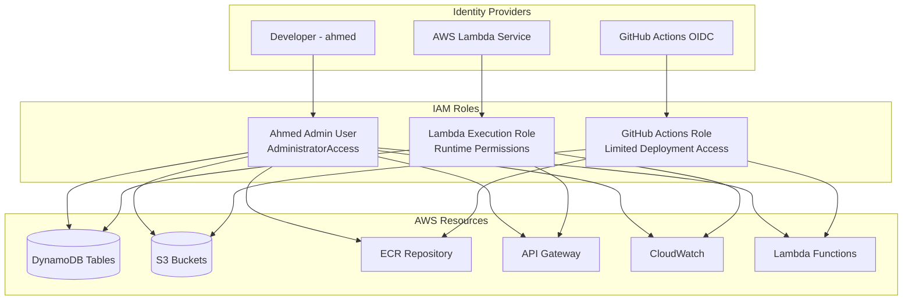

# IAM Security Architecture

Comprehensive documentation of the Identity and Access Management (IAM) security model implemented in the Number Acidizer project.

## Security Philosophy

The IAM design follows AWS security best practices with a **zero-trust model** and **principle of least privilege**:

1. **Explicit Permissions**: No implicit access, everything must be explicitly granted
2. **Resource-Scoped**: Permissions tied to specific resources, minimal wildcards
3. **Role-Based Access**: Function-specific roles with minimal cross-cutting permissions
4. **Temporary Credentials**: OIDC tokens for CI/CD, no long-lived access keys in production
5. **Defense in Depth**: Multiple security layers from network to application level

## IAM Roles and Policies Overview



## 1. Developer Access (Personal Account)

### Admin User Configuration

```hcl
resource "aws_iam_user" "ahmed" {
  name = "ahmed-${var.project_name}-admin"
  path = "/"

  tags = {
    Name = "Ahmed Admin User"
    Role = "Administrator"
    Project = "NumberAcidizer"
  }
}

resource "aws_iam_user_policy_attachment" "ahmed_admin" {
  user       = aws_iam_user.ahmed.name
  policy_arn = "arn:aws:iam::aws:policy/AdministratorAccess"
}
```

### Why Administrator Access?

- **Personal AWS Account**: Full control needed for experimentation and development
- **Educational Purpose**: Allows exploration of AWS services without permission barriers
- **Development Flexibility**: Can create/modify resources as needed during development
- **Not Production Pattern**: In enterprise environments, would use role-based access with specific permissions

### Security Considerations

- **MFA Enabled**: Multi-factor authentication required for console access
- **Access Key Rotation**: Regular rotation of programmatic access keys
- **CloudTrail Logging**: All actions logged for audit purposes
- **Personal Account Scope**: Limited to personal AWS account, not enterprise environment

## 2. GitHub Actions CI/CD Role

### OIDC Provider Setup

```hcl
resource "aws_iam_openid_connect_provider" "github" {
  url = "https://token.actions.githubusercontent.com"

  client_id_list = ["sts.amazonaws.com"]

  thumbprint_list = [
    "6938fd4d98bab03faadb97b34396831e3780aea1"
  ]
}
```

### GitHub Actions Role

```hcl
resource "aws_iam_role" "github_actions" {
  name = "${var.project_name}-github-actions-${var.environment}"

  assume_role_policy = jsonencode({
    Version = "2012-10-17"
    Statement = [{
      Effect = "Allow"
      Principal = {
        Federated = aws_iam_openid_connect_provider.github.arn
      }
      Action = "sts:AssumeRoleWithWebIdentity"
      Condition = {
        StringEquals = {
          "token.actions.githubusercontent.com:aud" = "sts.amazonaws.com"
        }
        StringLike = {
          "token.actions.githubusercontent.com:sub" = "repo:YOUR_GITHUB_USERNAME/number-acidizer:*"
        }
      }
    }]
  })
}
```

### GitHub Actions Permissions Policy

```hcl
resource "aws_iam_policy" "github_actions" {
  name = "${var.project_name}-github-actions-policy-${var.environment}"

  policy = jsonencode({
    Version = "2012-10-17"
    Statement = [
      {
        Sid = "ECRAccess"
        Effect = "Allow"
        Action = [
          "ecr:GetAuthorizationToken",
          "ecr:BatchCheckLayerAvailability",
          "ecr:GetDownloadUrlForLayer",
          "ecr:BatchGetImage",
          "ecr:InitiateLayerUpload",
          "ecr:UploadLayerPart",
          "ecr:CompleteLayerUpload",
          "ecr:PutImage"
        ]
        Resource = aws_ecr_repository.backend.arn
      },
      {
        Sid = "LambdaDeployment"
        Effect = "Allow"
        Action = [
          "lambda:UpdateFunctionCode",
          "lambda:GetFunction"
        ]
        Resource = [
          aws_lambda_function.api.arn,
          aws_lambda_function.stream_handler.arn
        ]
      },
      {
        Sid = "S3FrontendDeployment"
        Effect = "Allow"
        Action = [
          "s3:PutObject",
          "s3:PutObjectAcl",
          "s3:GetObject",
          "s3:DeleteObject",
          "s3:ListBucket"
        ]
        Resource = [
          aws_s3_bucket.frontend.arn,
          "${aws_s3_bucket.frontend.arn}/*"
        ]
      },
      {
        Sid = "CloudFrontInvalidation"
        Effect = "Allow"
        Action = [
          "cloudfront:CreateInvalidation",
          "cloudfront:GetInvalidation"
        ]
        Resource = aws_cloudfront_distribution.frontend.arn
      }
    ]
  })
}
```

### Security Benefits of OIDC

| Traditional Approach                              | OIDC Approach                         |
| ------------------------------------------------- | ------------------------------------- |
| Long-lived access keys stored in GitHub secrets   | Temporary tokens (1 hour max)         |
| Manual key rotation required                      | Automatic token rotation              |
| Keys can be extracted if repo is compromised      | Tokens tied to specific workflow runs |
| No audit trail of which workflow used credentials | Full audit trail with GitHub context  |
| Admin overhead for key management                 | Zero key management overhead          |

## 3. Lambda Execution Role

### Lambda Role Definition

```hcl
resource "aws_iam_role" "lambda" {
  name = "${var.project_name}-lambda-role-${var.environment}"

  assume_role_policy = jsonencode({
    Version = "2012-10-17"
    Statement = [{
      Action = "sts:AssumeRole"
      Effect = "Allow"
      Principal = {
        Service = "lambda.amazonaws.com"
      }
    }]
  })
}
```

### Lambda Execution Policy

```hcl
resource "aws_iam_policy" "lambda_policy" {
  name = "${var.project_name}-lambda-policy-${var.environment}"

  policy = jsonencode({
    Version = "2012-10-17"
    Statement = [
      {
        Sid = "DynamoDBTableAccess"
        Effect = "Allow"
        Action = [
          "dynamodb:GetItem",
          "dynamodb:UpdateItem",
          "dynamodb:PutItem",
          "dynamodb:Query",
          "dynamodb:Scan",
          "dynamodb:DeleteItem",
          "dynamodb:BatchWriteItem",
          "dynamodb:TransactWriteItems"
        ]
        Resource = [
          aws_dynamodb_table.counter.arn,
          aws_dynamodb_table.audit.arn,
          aws_dynamodb_table.websocket_connections.arn,
          "${aws_dynamodb_table.audit.arn}/index/*"
        ]
      },
      {
        Sid = "DynamoDBStreamAccess"
        Effect = "Allow"
        Action = [
          "dynamodb:DescribeStream",
          "dynamodb:GetRecords",
          "dynamodb:GetShardIterator",
          "dynamodb:ListStreams"
        ]
        Resource = "${aws_dynamodb_table.counter.arn}/stream/*"
      },
      {
        Sid = "WebSocketAPIAccess"
        Effect = "Allow"
        Action = [
          "execute-api:ManageConnections"
        ]
        Resource = [
          "${aws_apigatewayv2_api.websocket.execution_arn}/*/*"
        ]
      },
      {
        Sid = "CloudWatchLogsAccess"
        Effect = "Allow"
        Action = [
          "logs:CreateLogGroup",
          "logs:CreateLogStream",
          "logs:PutLogEvents"
        ]
        Resource = [
          "arn:aws:logs:${data.aws_region.current.name}:${data.aws_caller_identity.current.account_id}:log-group:/aws/lambda/${var.project_name}-*"
        ]
      },
      {
        Sid = "XRayAccess"
        Effect = "Allow"
        Action = [
          "xray:PutTraceSegments",
          "xray:PutTelemetryRecords"
        ]
        Resource = "*"
      }
    ]
  })
}
```

### Permission Breakdown

#### DynamoDB Permissions

- **Read Operations**: `GetItem`, `Query`, `Scan` for retrieving counter values and connection data
- **Write Operations**: `UpdateItem`, `PutItem` for counter updates and connection management
- **Transaction Support**: `TransactWriteItems` for ACID compliance
- **Audit Trail**: Write access to audit table for compliance logging
- **Index Access**: Query operations on GSI for audit table lookups

#### API Gateway Permissions

- **WebSocket Management**: `execute-api:ManageConnections` for broadcasting messages
- **Resource Scoped**: Limited to specific WebSocket API execution ARN
- **Stage Agnostic**: Works across all stages (`/*/*` pattern)

#### CloudWatch Permissions

- **Log Management**: Create log groups and streams for application logging
- **Structured Logging**: Support for JSON-formatted log entries
- **Resource Scoped**: Limited to project-specific log groups

#### X-Ray Permissions

- **Distributed Tracing**: Put trace segments for request tracking
- **Performance Monitoring**: Telemetry data for latency analysis
- **Global Resource**: X-Ray requires wildcard resource (AWS limitation)

## 4. Resource-Level Security

### DynamoDB Security

#### Table-Level Security

```hcl
resource "aws_dynamodb_table" "counter" {
  # ... table configuration ...

  server_side_encryption {
    enabled = true
  }

  point_in_time_recovery {
    enabled = true
  }

  tags = {
    Environment = var.environment
    Project     = var.project_name
    DataClass   = "application-data"
  }
}
```

#### Access Patterns

| Operation            | Required Permission                       | Resource Scope             |
| -------------------- | ----------------------------------------- | -------------------------- |
| Get counter value    | `dynamodb:GetItem`                        | Counter table ARN          |
| Increment/Decrement  | `dynamodb:TransactWriteItems`             | Counter + Audit table ARNs |
| WebSocket connection | `dynamodb:PutItem`, `dynamodb:DeleteItem` | Connections table ARN      |
| Audit queries        | `dynamodb:Query`                          | Audit table ARN + GSI      |

### S3 Security

#### Bucket Policy

```hcl
resource "aws_s3_bucket_policy" "frontend" {
  bucket = aws_s3_bucket.frontend.id

  policy = jsonencode({
    Version = "2012-10-17"
    Statement = [
      {
        Sid    = "AllowCloudFrontServicePrincipal"
        Effect = "Allow"
        Principal = {
          Service = "cloudfront.amazonaws.com"
        }
        Action   = "s3:GetObject"
        Resource = "${aws_s3_bucket.frontend.arn}/*"
        Condition = {
          StringEquals = {
            "AWS:SourceArn" = aws_cloudfront_distribution.frontend.arn
          }
        }
      }
    ]
  })
}
```

#### Security Features

- **Origin Access Control (OAC)**: Only CloudFront can access S3 objects
- **Public Access Blocked**: Direct S3 access disabled
- **Encryption at Rest**: Server-side encryption enabled
- **Versioning**: Object versioning for rollback capability

### API Gateway Security

#### CORS Configuration

```hcl
cors_configuration {
  allow_origins     = var.allowed_origins
  allow_methods     = ["GET", "POST", "OPTIONS"]
  allow_headers     = ["Content-Type", "X-Request-ID", "X-Client-ID"]
  expose_headers    = ["X-Request-ID"]
  max_age           = 300
  allow_credentials = false
}
```

#### Throttling and Rate Limiting

```hcl
throttle_settings {
  rate_limit  = 1000
  burst_limit = 2000
}
```

#### Security Headers

- **HTTPS Only**: TLS 1.2+ enforced
- **Request Validation**: Input validation at gateway level
- **Access Logging**: Comprehensive request logging
- **X-Ray Integration**: Distributed tracing enabled

## 5. Security Monitoring and Compliance

### CloudTrail Integration

```hcl
resource "aws_cloudtrail" "main" {
  name                         = "${var.project_name}-trail-${var.environment}"
  s3_bucket_name              = aws_s3_bucket.cloudtrail.bucket
  include_global_service_events = true
  is_multi_region_trail       = true
  enable_log_file_validation  = true

  event_selector {
    read_write_type                 = "All"
    include_management_events       = true
    data_resource {
      type   = "AWS::DynamoDB::Table"
      values = ["${aws_dynamodb_table.counter.arn}/*"]
    }
  }
}
```

### Security Metrics and Alarms

```hcl
resource "aws_cloudwatch_metric_alarm" "unauthorized_api_calls" {
  alarm_name          = "unauthorized-api-calls-${var.environment}"
  comparison_operator = "GreaterThanThreshold"
  evaluation_periods  = "2"
  metric_name         = "UnauthorizedAPICalls"
  namespace           = "AWS/CloudTrail"
  period              = "300"
  statistic           = "Sum"
  threshold           = "10"
  alarm_description   = "This metric monitors unauthorized API calls"
}
```

### Access Patterns Monitoring

- **Failed Authentication Attempts**: Monitor and alert on repeated failures
- **Unusual Access Patterns**: Detect anomalous API usage
- **Permission Violations**: Alert on access denied events
- **Resource Access Tracking**: Log all resource interactions

## 6. Security Best Practices Implemented

### Principle of Least Privilege

✅ **Resource-Specific ARNs**: Permissions tied to specific resources  
✅ **Action-Specific Permissions**: Only required actions granted  
✅ **Condition-Based Access**: OIDC conditions limit GitHub repository access  
✅ **Time-Limited Credentials**: Temporary tokens with automatic expiration

### Defense in Depth

✅ **Network Security**: HTTPS/TLS encryption for all communications  
✅ **Application Security**: Input validation and structured logging  
✅ **Data Security**: Encryption at rest and in transit  
✅ **Access Security**: Multi-factor authentication and audit logging

### Zero Trust Model

✅ **Explicit Permissions**: No implicit access granted  
✅ **Continuous Verification**: Token validation on every request  
✅ **Minimal Trust Scope**: Narrow permission boundaries  
✅ **Audit Everything**: Comprehensive logging and monitoring

### Compliance and Governance

✅ **Audit Trail**: CloudTrail logging for all API calls  
✅ **Data Classification**: Proper tagging for data governance  
✅ **Encryption Standards**: AES-256 encryption across all data stores  
✅ **Access Reviews**: Regular review of permissions and access patterns

## 7. Security Considerations for Production

### Enhanced Security Measures (Future Improvements)

1. **VPC Deployment**

   ```hcl
   # Deploy Lambda functions in VPC for network isolation
   vpc_config {
     subnet_ids         = var.private_subnet_ids
     security_group_ids = [aws_security_group.lambda.id]
   }
   ```

2. **Secrets Manager Integration**

   ```hcl
   # Store sensitive configuration in AWS Secrets Manager
   resource "aws_secretsmanager_secret" "app_config" {
     name = "${var.project_name}-config-${var.environment}"
   }
   ```

3. **WAF Protection**

   ```hcl
   # Web Application Firewall for API protection
   resource "aws_wafv2_web_acl" "api_protection" {
     name  = "${var.project_name}-waf-${var.environment}"
     scope = "REGIONAL"
   }
   ```

4. **GuardDuty Integration**
   ```hcl
   # Threat detection service
   resource "aws_guardduty_detector" "main" {
     enable = true
   }
   ```

### Multi-Environment Security

| Environment     | Security Level | Additional Controls                      |
| --------------- | -------------- | ---------------------------------------- |
| **Development** | Standard       | Basic logging, developer access          |
| **Staging**     | Enhanced       | Production-like security, limited access |
| **Production**  | Maximum        | WAF, GuardDuty, VPC, enhanced monitoring |

## 8. Security Incident Response

### Incident Classification

1. **Low**: Unusual access patterns detected
2. **Medium**: Unauthorized access attempts
3. **High**: Confirmed security breach
4. **Critical**: Data exfiltration or system compromise

### Response Procedures

1. **Detection**: CloudWatch alarms and GuardDuty findings
2. **Assessment**: Review CloudTrail logs and access patterns
3. **Containment**: Disable compromised credentials or resources
4. **Recovery**: Restore from backups if necessary
5. **Lessons Learned**: Update security policies and procedures

This comprehensive IAM security model ensures robust protection while maintaining operational efficiency and compliance with security best practices.
